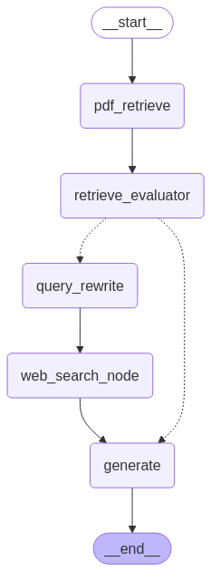

하기의 내용은 <a href="https://wikidocs.net/233801" target="_blank">LangChain 노트</a> 기반으로 작성했습니다.

# Corrective RAG
이번절에서는 **Corrective RAG**의 전략을 이용하여 RAG기반 시스템을 개선해보겠습니다. **Corrective RAG**는 이전 <a href="https://drepion43.github.io/langchain/langgraph12/#graph-compile" target="_blank">Adaptive RAG</a>에서 다뤘던 내용입니다. 한번 더 자세하게 살펴보자면 **Corrective RAG**는 검색된 문서들에 대해 자기 반성(self-reflection) 및 자기 평가(self-evaluation)을 통해, 검색-생성(RAG)를 더 정교하게/정확하게 다룰 수 있도록 도와줍니다. 즉, **검색 과정에서 찾아온 문서를 평가하고, 지식을 정제(refine) 하는 단계를 추가한 방법론**입니다.    
<br>
더 자세한 내용을 알아보고 싶으신 분은 하기의 논문을 한번 리딩해보시는 것도 추천드립니다.   
<a href="https://arxiv.org/pdf/2401.15884" target="_blank">Corrective RAG</a>   
하기의 내용을 간략하게 설명해보겠습니다.    
① 검색된 문서 중 하나 이상이 사전 정의된 관련성 임계값(retrieval validation score) 을 초과하면 생성 단계로 진행합니다.   
② 생성 전에 지식 정제 단계를 수행합니다.   
③ 문서를 "knowledge strips"로 세분화합니다.(여기서, 문서 검색 결과수, k를 의미합니다.)   
④ 각 지식 스트립을 평가하고 관련성 여부를 score 로 평가합니다. (여기서는 문서 chunk 단위로 평가합니다.)     
⑤ 모든 문서가 관련성 임계값 이하이거나 평가 결과 신뢰도가 낮을 경우, 추가 데이터 소스(예: 웹 검색)로 보강합니다.   
⑥ 웹 검색을 통한 보강 시, 쿼리 재작성(Query-Rewrite) 을 통해 검색 결과를 최적화합니다.   

<br>
그럼 이번절에서는 ②인 **지식 정제 단계**는 생략하며, 필요시 노드로 추가할 수 있는 형태로 설계해보겠습니다.   
또한, ⑤과 같이 관련 있는 문서가 하나도 없다면 **웹 검색**을 이용하여 검색을 보완하도록 설계하겠습니다. 그 후 쿼리 재작성(Query Rewrite)를 이용해 검색 최적화를 진행하겠습니다.   

<br>
크게 하기의 단계로 구성됩니다.   
- **Retrieval Grader**: 검색된 문서의 관련성을 평가
- **Generate**: LLM을 통한 답변 생성
- **Question Re-writer**: 질문 재작성을 통한 검색 질의 최적화
- **Web Search Tool**: Tavily Search를 통한 웹 검색 활용
- **Create Graph**: LangGraph를 통한 CRAG 전략 그래프 생성
- **Use the graph**: 생성된 그래프를 활용하는 방법

## Generate & Retrieval Grader
기존에 배웠던 Retrieval를 생성하고 이 Retrieval가 가져온 문서가 질문과 평가하는 Relevence Check를 구현하겠습니다.   
```python
class RAGPDFChain:
    def __init__(self, pdf, llm):
        self.llm = llm
        self.pdf = pdf
    
    def create_retriever(self, 
                         embeddings: object = OpenAIEmbeddings(model="text-embedding-ada-002")):
        loader = PyPDFLoader(self.pdf)

        text_splitter = RecursiveCharacterTextSplitter(chunk_size=1000, chunk_overlap=100)
        split_docs = loader.load_and_split(text_splitter)
        vector = FAISS.from_documents(split_docs, embeddings)
        retriever = vector.as_retriever()
        return retriever

        
    def format_docs(self, docs):
        """검색된 문서들을 하나의 문자열로 포맷팅"""
        context = ""
        for doc in docs:
            context += doc.page_content
            context += '\n'
        return context
            

    def invoke(self, inputs):
        question = inputs.get("question", "")
        context = inputs.get("context", [])
        if isinstance(context, list):
            context = self.format_docs(context)
        history = inputs.get("chat_history", [])
        history = " ".join(history)
        
        template = """
        다음 정보는 이전 대화에 대한 내용입니다.
        {chat_history}
        
        다음 정보를 바탕으로 질문에 답하세요:
        {context}

        질문: {question}
        
        주어진 질문에만 답변하세요. 문장으로 답변해주세요.
        답변:
        """
        prompt = PromptTemplate.from_template(template)
        
        rag_chain = (
            prompt
            | self.llm
            | StrOutputParser()
        )
        answer = rag_chain.invoke({"chat_history": history, "context":context, "question":question })
        
        return answer

rag_chain = RAGPDFChain(llm=ChatOpenAI(model="gpt-4o-mini"), pdf="./data/AI_brief_2023년_2월호.pdf")
pdf_retriever = rag_chain.create_retriever()
answer = rag_chain.invoke(
    {
        "question": "AI관련 최근 국내외 정책은 어때?",
        "context": pdf_retriever,
        "chat_history": [],
    }
)
# pdf_retriever -> 문서 검색기
# rag_chain -> Generate 
```

하기는 가장 간단하게 구현한 PDF RAG Chain이고 이어서 Question과 Retrieval간의 Relevence Check도 구현해보겠습니다.   
```python
"""질문과 Retrieval간의 관련성"""    
class QuestionRetrievalScore(BaseModel):
    score : str = Field(
        description="relevant or not relevant. Answer 'yes' if the question is relevant to the retrieved document else answer 'no'"
    )

class RelevanceChecker:
    """
    해당 class는 input에 대한 타입에 따라 관련성을 평가하는 클래스입니다.
    관련이 있다면 "yes", 없다면 "no"를 반환합니다.
    
    크게 3가지의 타입에 관련한 관련성 평가합니다.
    (Question-Answer, Question-Retrieval, Answer-Retrieval)
    """
    
    def __init__(self, llm: object, types: str = "question-answer"):
        self.llm = llm
        self.types = types
    if self.types == "question-retrieval":
        model = self.llm.with_structured_output(QuestionRetrievalScore)
        template = """You are a grader assessing whether a retrieved document is relevant to the given question. \n
            Here is the question: \n\n {question} \n\n
            Here is the retrieved document: \n\n {context} \n
            If the document contains information that could help answer the question, grade it as relevant. \n
            Consider both semantic meaning and potential usefulness for answering the question. \n
            
            Give a binary score 'yes' or 'no' score to indicate whether the retrieved document is relevant to the question."""
        input_vars = ["question", "context"]
    else:
        raise ValueError(f"Invalid Types : {self.types}")
    prompt = PromptTemplate(template=template, input_variables=input_vars)
    
    chain = prompt | model
    return chain

question_retrieval_relevant = RelevanceChecker(  
        llm=ChatOpenAI(model="gpt-4o-mini", temperature=0), types="question-retrieval"  
    ).create()
# question_retrieval_relevant -> Question & Retrieval Relevence Checker
```

## Question Re-writer & Web Search Tool
이번에는 방금전에 Retrieval Grader를 구현했습니다. 만약 이 Retrieval Grader가 "No"라고 내뱉을 경우, Query를 재작성을 수행해야합니다. 이를 수행하는 Query Rewrite용 LLM을 구현하겠습니다.   
```python
# LLM 초기화
llm = ChatOpenAI(model="gpt-4o-mini", temperature=0)
# Query Rewriter 프롬프트 정의(자유롭게 수정이 가능합니다)
system = """You a question re-writer that converts an input question to a better version that is optimized \n 
for vectorstore retrieval. Look at the input and try to reason about the underlying semantic intent / meaning."""
# Query Rewriter 프롬프트 템플릿 생성
re_write_prompt = ChatPromptTemplate.from_messages(
    [
        ("system", system),
        (
            "human",
            "Here is the initial question: \n\n {question} \n Formulate an improved question.",
        ),
    ]
)
# Query Rewriter 생성
question_rewriter = re_write_prompt | llm | StrOutputParser()

print(f'[원본 질문]: "{"AI관련 최근 국내외 정책은 어때?"}"')
print("[쿼리 재작성]:", question_rewriter.invoke({"question": "AI관련 최근 국내외 정책은 어때?"}))
```
이 재작성된 Question을 기반으로 다시 Retrieval를 수행하는 형식으로 진행될 것 입니다. 그럼 이어서 만약 문석 검색기에 계속해서 탐색해도 문서를 찾을 수 없다면, 외부(웹) 검색을 통해 가져와야하는 이를 이용하는 Tool인 Tavily Search tool을 구현하겠습니다.   
```python
from langchain_core.documents import Document

web_search_tool = TavilySearchResults(
    max_results=3
    )
search_result = web_search_tool.invoke("AI관련 최근 국내외 정책은 어때?")
web_results_docs = [
    Document(
        page_content=web_result["content"],
        metadata={"source": web_result["url"]},
    )
    for web_result in search_result
]
print(web_results_docs)
```

## Node 생성
이제 이렇게 필요한 기능들을 수행하는 LLM들을 다 만들었습니다. 이제 이들을 뭉쳐서 LangGraph의 Node로 구현한 후, 서로 Message를 주고받게 하면 CRAG의 시스템 구축이 완료됩니다. 따라서 우선 필요한 STate를 먼저 정의해보겠습니다. 생각해보면, 우선 질문을 다른 Node로 전달을 해야하니, **Question의 변수**가 필요하며, **Retreive한 문서**도 전달을 해줘야합니다. 또, 웹 검색을 수행한다했으니 **웹검색을 수행할지 말지를 담는 변수**도 필요합니다. 마지막으로 최종 생성한 답변이 잘못된 경우, 다시 회귀하는 작업도 필요하니 그럼 이 **Generation**을 담을 변수도 필요할 것 입니다 이 4개를 가지는 GraphState를 정의해보겠습니다.    
```python
# State 정의
class GraphState(TypedDict):
    question: Annotated[str, "The question to answer"]
    generation: Annotated[str, "The generation from the LLM"]
    web_search: Annotated[str, "Whether to add search"]
    documents: Annotated[List[str], "The documents retrieved"]
```

우선 **PDF 검색기**와 **답변 생성** Node부터 구현해보겠습니다. PDF 검색기는 질문을 받아 이를 PDF Retrieval에 넘겨주고 이에 대한 결과를 GraphState의 documents 넣어 넘겨주면 됩니다. 답변 생성은 이전에 구현했던 RAG Chain을 이용하면 되는데, RAG Chain에 Document결과와 질문을 같이 넘겨주면 기존 RAG와같이 답변을 생성하게 되는데, 이를 generation에 담아 넘겨주면 됩니다.    
```python
# 문서 검색 노드
def retrieve(state: GraphState) -> GraphState:
    print("\n==== RETRIEVE ====\n")
    question = state["question"]

    # 문서 검색 수행
    documents = pdf_retriever.invoke(question)
    return GraphState(documents=documents)

# 답변 생성 노드
def generate(state: GraphState) -> GraphState:
    print("\n==== GENERATE ====\n")
    question = state["question"]
    documents = state["documents"]

    # RAG를 사용한 답변 생성
    generation = rag_chain.invoke({"context": documents, "question": question})
    return GraphState(generation=generation)
```  

이어서 CRAG의 가장 중요한 **자기 반성** 및 **자기 평가**인 문서 평가기를 구현해보겠습니다. 문서 평가기에서는 이전에 생성했던 Question과 Retrieve간의 관련성을 평가하는 LLM을 이용하여 평가하면됩니다. 이 때, PDF Retrieve에서 가져온 다양한 문서들에 대해 한 번 더 QA-Retrieve LLM으로 평가하여 정말 질문과 관련이 있는 것들만 document로 남기고 관련이 없다고 정의한 것들은 filtering을 시켜줍니다. 또한, 만약 filtering 후 문서의 개수가 0개라면 web Search를 진행해야하는데, 이에 대한 정보도 "yes" or "no"로 GraphState의 web_search 변수에 담아 함께 넘겨주면 됩니다.    
```python
"""문서 관련성 평가"""
def grade_documents(state: GraphState) -> GraphState:
    print("==== [CHECK DOCUMENT RELEVANCE TO QUESTION] ====")
    question = state["question"]
    documents = state["documents"]
    
    # 관련성 있는 문서만 남기기
    relevence_documents = []
    for doc in documents:
        grade = question_retrieval_relevant.invoke({"question": question, "context": doc})
        score = grade.score
        # 관련성이 있다면 추가
        if score == "yes":
            print("---GRADE: DOCUMENT RELEVANT---")
            relevence_documents.append(doc)
        else:
            print("---GRADE: DOCUMENT NOT RELEVANT---")
            continue
    relevence_doc_count = len(relevence_documents)
    web_search = "Yes" if relevence_doc_count == 0 else "No"
    return GraphState(documents=relevence_documents, web_search=web_search)
``` 

이어서 마지막으로 쿼리 재작성 Node와 Web Search Node를 구현해보겠습니다. 쿼리 재작성 Node는 이전에 만들었던 Query Rewrite LLM을 이용하여, 수정되기 전 질문을 해당 LLM의 Input으로 넣어주면, 재생성된 질의를 얻어 넘겨주면됩니다. Web Search의 Node 또한, 현재 질의를 Tavily Search Tool에 넣어 이의 결과를 변환받아, 현재 document에 추가하여 document를 넘겨주면 됩니다.   
```python
"""쿼리 재작성"""
def rewrite_query(state: GraphState) -> GraphState:
    print("==== [TRANSFORM QUERY] ====")
    question = state["question"]
    rewrite_query = question_rewriter.invoke({"question":question})
    return GraphState(question=rewrite_query)

"""웹 검색 노드"""
def web_search_node(state: GraphState) -> GraphState:
    print("\n==== [WEB SEARCH] ====\n")
    question = state["question"]
    documents = state["documents"]

    # 웹 검색 수행
    docs = web_search_tool.invoke({"query": question})
    # 검색 결과를 문서 형식으로 변환
    web_results = "\n".join([d["content"] for d in docs])
    web_results = Document(page_content=web_results)
    documents.append(web_results)

    return GraphState(documents=documents)
```

## Edge
이때까지 이번 CRAG시스템에 필요한 LangGraph Node를 구현했습니다. 그럼 이제 이 Node들을 잘 이어줄 수 있는 Edge의 구현이 필요합니다.    
여기서 **라우팅**을 고려해보면, GraphState에서 web_search값이 "yes"라면, 현재 document가 1개도 없다는 의미가 되므로, 질의자체가 잘못되어 이 질의를 수정해야할 필요가 있다고 느껴집니다. 따라서, web_serach값이 "yes"라면, 다시 Query Rewrite Node로 진행하면 되고, 만약 "no"라면 답변을 생성하는 generate Node로 브랜치를 이어주면 될 것 입니다.    
```python
from typing_extensions import TypedDict, Annotated, Literal

def decide_to_generate(state: GraphState) -> Literal["query_rewrite", "generate"]:
    # 평가된 문서를 기반으로 다음 단계 결정
    print("==== [ASSESS GRADED DOCUMENTS] ====")
    # 웹 검색 필요 여부
    web_search = state["web_search"]

    if web_search == "Yes":
        # 웹 검색으로 정보 보강이 필요한 경우
        print(
            "==== [DECISION: ALL DOCUMENTS ARE NOT RELEVANT TO QUESTION, QUERY REWRITE] ===="
        )
        # 쿼리 재작성 노드로 라우팅
        return "query_rewrite"
    else:
        # 관련 문서가 존재하므로 답변 생성 단계(generate) 로 진행
        print("==== [DECISION: GENERATE] ====")
        return "generate"
```

## Graph Compile
이제 최종적으로 각 Node 및 Edge들을 이용하여 Graph를 구현 후 컴파일까지 수행하겠습니다. 그리고 최종적으로 어떤 형태르 이어지는지 시각화로 확인해보겠습니다.   
```python
workflow = StateGraph(GraphState)

# Node 추가
workflow.add_node("pdf_retrieve", retrieve)
workflow.add_node("retrieve_evaluator", grade_documents)
workflow.add_node("query_rewrite", rewrite_query)
workflow.add_node("web_search_node", web_search_node)
workflow.add_node("generate", generate)

# Edge 추가
workflow.set_entry_point("pdf_retrieve")
workflow.add_edge("pdf_retrieve", "retrieve_evaluator")
workflow.add_conditional_edges(
    "retrieve_evaluator",
    decide_to_generate,
    {
        "query_rewrite": "query_rewrite",
        "generate": "generate"
    }
)
workflow.add_edge("query_rewrite", "web_search_node")
workflow.add_edge("web_search_node", "generate")
workflow.add_edge("generate", END)

app = workflow.compile(checkpointer=MemorySaver())
```

<div style="text-align : center;">
    
</div>    

<br>
이제 구축한 시스템의 결과를 확인해보겠습니다. 하기의 코드를 돌려 나온 출력도 나타내보겠습니다.    
```python
from langchain_core.runnables import RunnableConfig
from stream import *

# stream function

inputs = GraphState(question="삼성 가우스 전자에 대해 알려줘.")
# config 설정(재귀 최대 횟수, thread_id)
config = RunnableConfig(recursion_limit=20, configurable={"thread_id": "1"})

node_names = ["pdf_retrieve", "retrieve_evaluator", "query_rewrite", "web_search_node", "generate"]
streamer(app=app, inputs=inputs, config=config, node_names=node_names)
```

```bash
==== RETRIEVE ====

==== [CHECK DOCUMENT RELEVANCE TO QUESTION] ====

==================================================
🔄 Node: retrieve_evaluator 🔄
- - - - - - - - - - - - - - - - - - - - - - - - - 
---GRADE: DOCUMENT NOT RELEVANT---
---GRADE: DOCUMENT NOT RELEVANT---
---GRADE: DOCUMENT NOT RELEVANT---
---GRADE: DOCUMENT NOT RELEVANT---
==== [ASSESS GRADED DOCUMENTS] ====
==== [DECISION: ALL DOCUMENTS ARE NOT RELEVANT TO QUESTION, QUERY REWRITE] ====
==== [TRANSFORM QUERY] ====

==================================================
🔄 Node: query_rewrite 🔄
- - - - - - - - - - - - - - - - - - - - - - - - - 
삼성 가우스 전자에 대한 정보와 주요 특징은 무엇인가요?
==== [WEB SEARCH] ====


==== GENERATE ====


==================================================
🔄 Node: generate 🔄
- - - - - - - - - - - - - - - - - - - - - - - - - 
삼성 가우스는 삼성전자의 멀티모달 생성형 인공지능 모델로, 클라우드와 온디바이스를 위한 다양한 AI 모델이 포함되어 있으며, 텍스트, 코드, 이미지 생성을 위한 언어 모델, 코드 모델, 이미지 모델 등 3가지 주요 모델로 구성되어 있습니다.
```