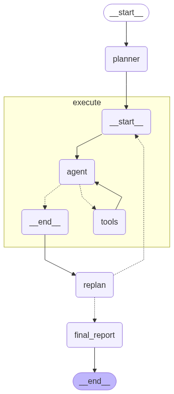

하기의 내용은 <a href="https://wikidocs.net/233801" target="_blank">LangChain 노트</a> 기반으로 작성했습니다.

# Plan-and-Excute
이번 절에서는 "plan-and-excute" 스타일의 에이전트를 만드는 방법에 대해 알아보겠습니다.    
**Plan-and-Excute**전략은 복잡한 작업을 수행할 때 장기적인 계획을 먼저 세우고, 해당 계획을 단계별로 실행하며 필요에 따라 계획을 수정하여 접근하는 전략입니다. 즉, 크게 **장기 계획 수립**과 **단계별 실행 및 재계획**의 과정으로 수행됩니다.   
<br>
이 Plan-and-Excute전략은 <a href="https://arxiv.org/abs/2305.04091" target="_blank">Plan-and-Solve 논문</a>에서 영감을 받았으며, 기존의 <a href="https://arxiv.org/abs/2210.03629" target="_blank">ReAct 논문</a>의 에이전트에서 한 번에 한 단계씩 생각하는 반면, Plan-and-Excute는 명시적이고 장기적인 계획을 강조합니다.    
이렇게 장기적인 계획을 수립하여 단계식 수행을 할 경우, 수립한 계획을 따라 단계를 수행하기 때문에 **보다 안정적인 진행**이 가능합니다. 또한, 계획 단계에서는 **크고 강력한 모델**을 사용하지만, 그 이후, 실행단계에서는 상대적으로 **작고 가벼운 모델**을 사용해도 무방함으로 **자원 소비 최적화**를 할 수 있습니다.   
<br>
그럼 직접 실습을 해보기 전, 어떤 것들을 구현해야하는지 간략하게 살펴보겠습니다.   
① 도구 정의: agent가 사용할 도구를 정의해야합니다.   
② 실행 에이전트 정의: 실제 작업을 수행할 에이전트를 정의해야합니다.   
③ 상태 정의: 에이전트의 상태를 정의해야합니다.    
④ **계획 단계**: 장기 계획을 세우는 단계를 생성해야합니다.     
⑤ **재계획 단계**: 작업 진행 상황에 따라 계획을 재수정하는 단계를 생성해야합니다.   
⑥ 그래프 생성 및 컴파일: 상기의 단계들을 연결하는 그래프를 생성해야합니다.    

## Create Agent
우선 ①과 ② 단계인 에이전트를 정의하겠습니다. langgraph에서 제공해주는 create_react_agent 메서드를 이용하여 빠르게, ReActAgent를 정의해보겠습니다. agent가 사용할 tool은 기본적인 TavilySearchTool을 이용하겠습니다.  
```python
from langchain_community.tools.tavily_search import TavilySearchResults
from langchain_openai import ChatOpenAI
from langgraph.prebuilt import create_react_agent
from langchain_core.prompts import ChatPromptTemplate

web_search_tool = TavilySearchResults(
    max_results=3
    )
tools = [web_search_tool]

prompt = ChatPromptTemplate.from_messages(
    [
        (
            "system",
            "You are a helpful assistant. Answer in Korean.",
        ),
        ("human", "{messages}"),
    ]
)
llm = ChatOpenAI(model="gpt-4o-mini", temperature=0)
agent_executor = create_react_agent(llm, tools, state_modifier=prompt)
```

## Plan 생성
이번에는 ③과 ④ 단계인 Plan에 필요한 State를 정의하고 Plan을 만들어 보겠습니다. 계획 수립을 위한 프롬프팅을 넣어준 planner라는 LLM 모델을 정의하고 출력은 pydantic의 BaseModel을 이용하여, 정해진 출력으로 뱉어내게 해보겠습니다.    
우선 Plan-Excute 시스템에 필요한 State를 정의하겠습니다.   
```python
import operator
from typing import Annotated, List, Tuple
from typing_extensions import TypedDict

"""parameter
input: 사용자입력
plan: 현재 계획
past_steps: 이전에 실행한 계획과 실행 결과
response: 최종 응답
"""
class PlanExcute(TypedDict):
    input: Annotated[str, "User's input"]
    plan: Annotated[List[str], "Current Plan"]
    past_steps: Annotated[List[Tuple], operator.add]
    response: Annotated[str, "Final response"]
    
```

이렇게 state에는 사용자의 입력, 현재 계획, 이전 계획, 최종 응답 4가지의 parameter가 필요합니다. 그럼 이어서 plan단계를 실습해보겠습니다.   

```python
from pydantic import BaseModel, Field
from typing import List

class Plan(BaseModel):
    """Sorted steps to excute the plan"""
    steps: Annotated[List[str], "Different steps to follow, should be in sorted order"]

# plan 생성
from langchain_core.prompts import ChatPromptTemplate
from langchain_openai import ChatOpenAI


# 계획 수립을 위한 프롬프트 템플릿 생성
planner_prompt = ChatPromptTemplate.from_messages(
    [
        (
            "system",
            """For the given objective, come up with a simple step by step plan. \
This plan should involve individual tasks, that if executed correctly will yield the correct answer. Do not add any superfluous steps. \
The result of the final step should be the final answer. Make sure that each step has all the information needed - do not skip steps.
Answer in Korean.""",
        ),
        ("placeholder", "{messages}"),
    ]
)

planner = planner_prompt | ChatOpenAI(model="gpt-4o-mini", temperature=0).with_structured_output(Plan)
```

상기의 planner에 "LangGraph 의 핵심 장단점과 LangGraph 를 사용하는 이유는 무엇인가?"라는 질의를 넣어주면,
```bash
Plan(steps=['LangGraph의 정의와 기능을 조사한다.', 'LangGraph의 핵심 장점을 정리한다.', 'LangGraph의 핵심 단점을 정리한다.', 'LangGraph를 사용하는 이유를 분석한다.', '조사한 내용을 바탕으로 최종 결론을 작성한다.'])
```
와 같이 대답을 하는 것을 확인할 수 있습니다. 즉, 사용자의 질의에 맞춰 답변을 뱉어내기까지의 필요한 과정을 나누어 계획을 세워주는 답변을 뱉어냅니다.    

## Re-Plan
이번에는 ⑤ 단계인 이전 단계의 결과를 바탕으로 계획을 다시 수립할지 사용자에게 답변을 제공할지를 결정하는 Re-Plan 단계에 대해 알아보겠습니다.   
```python
from typing import Union
class Response(BaseModel):
    # 사용자 응답
    response: str
    
class Act(BaseModel):
    # 수행할 작업: Response(사용자에게 응답할 경우), Plan(추가 도구 사용이 필요한 경우)
    action: Union[Response, Plan] = Field(
        description="Action to perform. If you want to respond to user, use Response."
        "If you need to further use tools to get the answer, use Plan. "
        )

# 계획을 재수립하기 위한 프롬프트 정의
replanner_prompt = ChatPromptTemplate.from_template(
    """For the given objective, come up with a simple step by step plan. \
This plan should involve individual tasks, that if executed correctly will yield the correct answer. Do not add any superfluous steps. \
The result of the final step should be the final answer. Make sure that each step has all the information needed - do not skip steps.

Your objective was this:
{input}

Your original plan was this:
{plan}

You have currently done the follow steps:
{past_steps}

Update your plan accordingly. If no more steps are needed and you can return to the user, then respond with that. Otherwise, fill out the plan. Only add steps to the plan that still NEED to be done. Do not return previously done steps as part of the plan.

Answer in Korean."""
)

replanner = replanner_prompt | ChatOpenAI(model="gpt-40-mini", temperature=0).with_structured_output(Act)
```

## Node 생성
이제 이렇게 필요한 기능들을 수행하는 LLM들을 다 만들었습니다. 이제 이들을 뭉쳐서 LangGraph의 Node로 구현한 후, 서로 Message를 주고받게 하면 Plan-and-Execute 시스템이 완성됩니다.   
그럼 순서대로 **계획 단계 정립**, **계획 수행(agent)**, **재계획 단계**, **최종 답변 생성**을 해보겠습니다.   
```python
from langchain_core.output_parsers import StrOutputParser

# 사용자의 입력을 기반으로 계획 단계 정립
def plan_step(state: PlanExcute) -> PlanExcute:
    plan = planner.invoke({"messages": [("user", state["input"])]})
    # 생성된 계획 단계 리스트 반환
    return PlanExcute(plan=plan.steps)

# agent를 통해 주어진 작업을 수행
def execute_step(state: PlanExcute) -> PlanExcute:
    plan = state["plan"]
    # 계획은 문자열로 변환
    plan_str = "\n".join(f"{i + 1}. {step}" for i, step in enumerate(plan))
    # 현재 실행할 작업
    task = plan[0]
    # 현재 실행할 작업을 format하여 agent에게 전달
    task_formatted = f"""For the following plan:
    {plan_str}\n\nYou are tasked with executing [step 1. {task}]."""
    # agent 작업 실행 및 결과 반환
    agent_response = agent_executor.invoke({"messages": ["user", task_formatted]})
    # 이전 단계와 그 결과를 함께 전달
    return PlanExcute(plan_steps=[(task, agent_response["messages"][-1].content)])

# 이전 단계의 결과를 바탕으로 계획을 업데이트하거나 최종 응답 반환
def replan_step(state: PlanExcute) -> PlanExcute:
    output = replanner.invoke(state)
    # 응답이 사용자에게 반환될 경우
    if isinstance(output.action, Response):
        return PlanExcute(response=output.action.response)
    # 추가 단계가 필요한 경우
    else:
        next_plan = output.action.steps
        if len(next_plan) == 0:
            return PlanExcute(response="No more steps need")
        else:
            return PlanExcute(plan=next_plan)
```

상기의 코드를 확인하시면, plan_step은 아까 계획 정립을 하는 LLM에게 user의 input을 넣어, 계획단계를 정립해주는 역할을 합니다.   
그 후, execute_step은 plan_step에서 넘겨받은 계획을 수행합니다. 이 때, 이전에 tavilysearch tool을 이용하는 agent를 통해 해당 작업을 수행합니다.   
그 후 replan_step에서는 이전 계획에 대한 결과를 바탕으로 응답을 반환하는데, 만약 응답이 최종 답변이면 최종 답변 Node로 그렇지 않다면 다시 execute Node로 분기시켜 다시 작업을 수행해줍니다.   
그럼 마지막으로 최종 답변을 생성해주는 Node를 확인하겠습니다.    
```python
# 최종 답변 생성
final_report_prompt = ChatPromptTemplate.from_template(
    """You are given the objective and the previously done steps. Your task is to generate a final report in markdown format.
Final report should be written in professional tone.

Your objective was this:

{input}

Your previously done steps(question and answer pairs):

{past_steps}

Generate a final report in markdown format. Write your response in Korean."""
)

final_report = final_report_prompt | ChatOpenAI(model="gpt-4o-mini", temperature=0) | StrOutputParser()

# 단계에 대한 결과를 함께 전달하여 최종 답변 생성
def generate_final_report(state: PlanExcute) -> PlanExcute:
    past_steps = "\n\n".join(
        [
            f"Question: {past_step[0]}\n\nAnswer: {past_step[1]}\n\n####"
            for past_step in state["past_steps"]
        ]
                             )
    
    response = final_report.invoke({"input": state["input"], "past_steps": past_steps})
    return PlanExcute(response=response)
```
이때까지의 단계별에 대한 결과를 프롬프트에 넣어주고 최종 답변을 생성해주는 final_report Node가 됩니다.   

## Edge
이때까지 이번 Plan-and-Execute 시스템에 필요한 LangGraph Node를 구현했습니다. 그럼 이제 이 Node들을 잘 이어줄 수 있는 Edge의 구현이 필요합니다. 여기서 **분기**점을 생각해보면, replan Node에서 최종 응답이 불가능하다면 다시 excute Node로 분기하는 지점에 대한 조건부 분기만이 필요하다는 것을 아실 겁니다. 그럼 해당 분기 엣지를 구현해보겠습니다.   
```python
# 에이전트의 실행 종료 여부를 결정하는 함수
def should_end(state: PlanExcute):
    if "response" in state and state["response"]:
        return "final_report"
    else:
        return "execute"
```

## Graph Compile
이제 최종적으로 각 Node 및 Edge들을 이용하여 Graph를 구현 후 컴파일까지 수행하겠습니다. 그리고 최종적으로 어떤 형태르 이어지는지 시각화로 확인해보겠습니다.    
```python
from langgraph.graph import END, StateGraph  
from langgraph.checkpoint.memory import MemorySaver

memory = MemorySaver()

workflow = StateGraph(PlanExcute)


# Node
workflow.add_node("planner", plan_step)
workflow.add_node("execute", execute_step)
workflow.add_node("replan", replan_step)
workflow.add_node("final_report", generate_final_report)


# edge
workflow.set_entry_point("planner")

workflow.add_edge("planner", "execute")
workflow.add_edge("execute", "replan")
workflow.add_edge("final_report", END)

# replan 후 종료 여부를 결정하는 함수 사용
workflow.add_conditional_edges(
    "replan",
    should_end,
    {
        "final_report": "final_report",
        "execute": "execute",
    }
)


app = workflow.compile(checkpointer=memory)
```

<div style="text-align : center;">
    
</div>    
