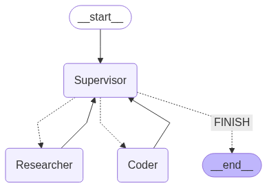

하기의 내용은 <a href="https://wikidocs.net/233801" target="_blank">LangChain 노트</a> 기반으로 작성했습니다.

# Supervisor
이번 절에서는 "Multi-Agent Network"를 LangGraph를 이용하고 구축하고, 각 Agent간의 작업을 Supervisor을 통해 효율적으로 조정하고 관리하는 방법에 대해 살펴보도록 하겠습니다.   
보통 Agent를 통한 시스템을 만들고자 할 때, 해당 시스템에 필요한 작업들이 매우 복잡하고 다양한 일을 수행할 수 있도록 설계하는게 일반적입니다. 기존의 Single-Agent로 수행하는 것은 매우 벅찬일일 수 있습니다. 또한, Single-Agent에게 여러개의 업무를 맡긴다면 이는 매우 비효율적입니다. 예를 들어, 사람으로 예시를 들어 생각해보겠습니다. 개발자라는 직업에도 다양한 분야가 존재하는데, 만약 한명이 인프라, 백엔드, 프론트, AI 등 모든 업무를 맡긴다면, 그 사람은 엄청난 과부하가 걸릴 수 있습니다. 따라서 보통 회사나 프로젝트를 수행할 때도, 해당 업무를 위한 전문가들이 각각 필요합니다. 사람과 비슷하게 Agent도 다양한 업무에 대한 Expert Agent들이 있다면, 혼자 수행하는 것보다 효율적으로 처리할 수 있을 것입니다.   
그럼 우선 Multi-Agent의 필요성에 대해 상기의 예시를 통해 이해하셨을 거라고 생각합니다. 즉, **Divde and Conquer**전략을 이용하여 각 Agent의 특정 업무와 전문성을 통해, 서로 Agent끼리 협업시키는 시스템이 필요합니다.   
여기서 추가적으로 보통 회사에서도 PM 이라는 직무가 존재합니다. 즉, 이는 Agent에서는 Supervisor라고 생각하시면 됩니다. 각 분야의 전문가들에게 어떤 일을 수행할지 라우팅을 해주며, 관리를 통해 보다 효율적으로 목표에 도달할 수 있게 도와주는 역할을 합니다.    
그럼 바로 실습을 해보도록 하겠습니다.   

## State and Tool
우선 Multi-Agent에서 사용할 State와 Tool을 정의해보도록 하겠습니다.    
Tool은 langchain에서 제공하는 웹 검색인 TavilySearch와 파이썬 실행 Tool인 PythonRepl Tool을 이용하겠습니다.   
```python
import operator
from typing import Annotated, Sequence
from typing_extensions import TypedDict

# 상태 정의
class AgentState(TypedDict):
    messages: Annotated[Sequence[BaseMessage], operator.add]  # 메시지
    next: str  # 다음으로 라우팅할 에이전트


from langchain_community.tools.tavily_search import TavilySearchResults
from langchain_experimental.utilities import PythonREPL
from langchain_core.tools import tool

tavily_tool = TavilySearchResults(
    max_results=5
    )
python_repl = PythonREPL()

@tool
def python_repl_tool(
    code: Annotated[str, "The python code to execute to generate your chart."],
):
    """Use this to execute python code. If you want to see the output of a value,
    you should print it out with `print(...)`. This is visible to the user."""
    try:
        # 주어진 코드를 Python REPL에서 실행하고 결과 반환
        result = python_repl.run(code)
    except BaseException as e:
        return f"Failed to execute code. Error: {repr(e)}"
    # 실행 성공 시 결과와 함께 성공 메시지 반환
    result_str = f"Successfully executed:\n```python\n{code}\n```\nStdout: {result}"
    return (
        result_str + "\n\nIf you have completed all tasks, respond with FINAL ANSWER."
    )
```

## Utility
코드에서 agent의 호출은 많이 일어나니 이런 기능을 함수로 묶어서 코드 가독성을 높일 수도 있습니다. 추후 functools.partial을 이용하여 호출하면됩니다.   
```python
from langchain_core.messages import HumanMessage


# 지정한 agent와 name을 사용하여 agent 노드를 생성
def agent_node(state, agent, name):
    # agent 호출
    agent_response = agent.invoke(state)
    # agent의 마지막 메시지를 HumanMessage로 변환하여 반환
    return {
        "messages": [
            HumanMessage(content=agent_response["messages"][-1].content, name=name)
        ]
    }
```

## Research and Code Agent
우선 실제 작업을 수행하는 2개의 Agent인 Research Agent와 Code Agent를 구현해보겠습니다. Research Agent는 TavilySearch Tool을 이용하고, Code Agent는 PythonRepl Tool을 이용합니다.   
```python
from langchain_core.messages import HumanMessage
from langgraph.prebuilt import create_react_agent
from langgraph.graph import MessagesState

research_agent = create_react_agent(llm, tools=[tavily_tool])

code_system_prompt = """
Be sure to use the following font in your code for visualization.

##### 폰트 설정 #####
import platform

# OS 판단
current_os = platform.system()

if current_os == "Windows":
    # Windows 환경 폰트 설정
    font_path = "C:/Windows/Fonts/malgun.ttf"  # 맑은 고딕 폰트 경로
    fontprop = fm.FontProperties(fname=font_path, size=12)
    plt.rc("font", family=fontprop.get_name())
elif current_os == "Darwin":  # macOS
    # Mac 환경 폰트 설정
    plt.rcParams["font.family"] = "AppleGothic"
else:  # Linux 등 기타 OS
    # 기본 한글 폰트 설정 시도
    try:
        plt.rcParams["font.family"] = "NanumGothic"
    except:
        print("한글 폰트를 찾을 수 없습니다. 시스템 기본 폰트를 사용합니다.")

##### 마이너스 폰트 깨짐 방지 #####
plt.rcParams["axes.unicode_minus"] = False  # 마이너스 폰트 깨짐 방지
"""


# Coder Agent 생성
coder_agent = create_react_agent(
    llm,
    tools=[python_repl_tool],
    state_modifier=code_system_prompt,
)
```

## Superivsor Agent
이어서 이번 절에서 핵심인 Supervisor를 정의해보겠습니다.   
Supervisor는 해당 작업을 수행할 선택해주는 역할을 합니다. 또한, 작업이 완료되면 완료된 상태를 return도 해줘야 합니다. 이를 하기에 구현해보겠습니다.   
```python
from pydantic import BaseModel
from typing import Literal

# 멤버 Agent 목록 정의
members = ["Researcher", "Coder"]

# 다음 작업자 선택 옵션 목록 정의
options_for_next = ["FINISH"] + members


# 작업자 선택 응답 모델 정의: 다음 작업자를 선택하거나 작업 완료를 나타냄
class RouteResponse(BaseModel):
    next: Literal[*options_for_next]

from langchain_core.prompts import ChatPromptTemplate, MessagesPlaceholder
# 시스템 프롬프트 정의: 작업자 간의 대화를 관리하는 감독자 역할
system_prompt = (
    "You are a supervisor tasked with managing a conversation between the"
    " following workers:  {members}. Given the following user request,"
    " respond with the worker to act next. Each worker will perform a"
    " task and respond with their results and status. When finished,"
    " respond with FINISH."
)

prompt = ChatPromptTemplate.from_messages(
    [
        ("system", system_prompt),
        MessagesPlaceholder(variable_name="messages"),
        (
            "system",
            "Given the conversation above, who should act next? "
            "Or should we FINISH? Select one of: {options}",
        ),
    ]
).partial(options=str(options_for_next), members=", ".join(members))

```

## Node 생성
이제 이렇게 필요한 기능들을 수행하는 LLM들을 다 만들었습니다. 이제 이들을 뭉쳐서 LangGraph의 Node로 구현한 후, Superivosr아래에서 수행되는 Multi-Agent System를 완성됩니다.   
```python
# Supervisor Agent 생성
import functools

def supervisor_agent(state):
    # 프롬프트와 LLM을 결합하여 체인 구성
    supervisor_chain = prompt | llm.with_structured_output(RouteResponse)
    # Agent 호출
    return supervisor_chain.invoke(state)


research_node = functools.partial(agent_node, agent=research_agent, name="Researcher")
coder_node = functools.partial(agent_node, agent=coder_agent, name="Coder")
```

## Graph Compile
이제 최종적으로 각 Node 및 Edge들을 이용하여 Graph를 구현 후 컴파일까지 수행하겠습니다. 그리고 최종적으로 어떤 형태르 이어지는지 시각화로 확인해보겠습니다.    
```python
from langgraph.graph import END, StateGraph  
from langgraph.checkpoint.memory import MemorySaver

memory = MemorySaver()

workflow = StateGraph(AgentState)


# Node
workflow.add_node("Researcher", research_node)
workflow.add_node("Coder", coder_node)
workflow.add_node("Supervisor", supervisor_agent)

# edge
workflow.set_entry_point("Supervisor")

# 멤버 노드 > Supervisor 노드로 엣지 추가
for member in members:
    workflow.add_edge(member, "Supervisor")
    
# 조건부 엣지 추가 (
conditional_map = {k: k for k in members}
conditional_map["FINISH"] = END

def get_next(state):
    return state["next"]

# Supervisor 노드에서 조건부 엣지 추가
workflow.add_conditional_edges("Supervisor", get_next, conditional_map)


app = workflow.compile(checkpointer=memory)
```


<div style="text-align : center;">
    
</div>    
