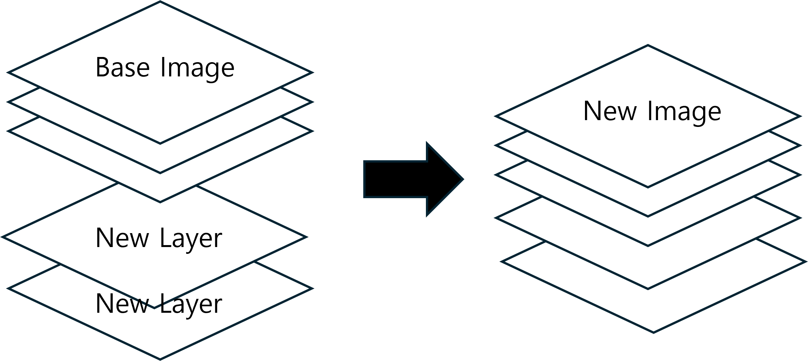

# 개요
이번절에서는 Docker Hub에 존재하는 이미지를 pull한 후, 나의 환경에 맞게 세팅 후 다시 이미지화를 만드는 방법인 Dockerfile에 대해 알아보도록 하겠습니다. 상기와 같이 이미지를 만드는 방법은 크게 2가지 방법이 존재합니다.    
① **Commit**   
현재 쓰고 있는 컨테이너를 이미지화 시키는 방법입니다. **commit** CLI를 통해 현재 컨테이너를 이미지화 시킬 수 있습니다.    
② **Dockerfile**   
Base Image를 가지고 온 후, 필요한 환경 세팅을 한번에 진행 후, 다시 **build** CLI를 통해 이미지화 하는 방법입니다.   
<br>
이번 절에서는 ② 방법인 Dockerfile에 대해 알아보겠습니다.   

## commit vs build
방금전에 이미지화를 만들기 위해 2가지 방법인 **commit**과 **build**가 존재한다고 했습니다.   
그럼 간단하게 2개의 차이가 어떤 것인지 살펴보겠습니다.   
**commit**은 현재 사용중인 컨테이너를 이미지로 만들어주는 CLI입니다. 즉, 현재 컨테이너의 환경 및 상태를 백업해두는 느낌이라고 이해하시면 됩니다. 따라서, **commit**을 수행하기 위해서는 해당 컨테이너가 실행 중이어야만 가능합니다.   
**build**는 Dockerfile을 통해 만들고 싶으면 환경을 구성할 수 있습니다. 즉, Dockerfile에 만들고 싶은 이미지를 **구체적**, **시간의 순서**에 따라 기록해두고 이의 순서대로 환경을 세팅하며 이미지를 생성하는 느낌이라고 이해하시면 됩니다.   

## Docker Image Layer
이제 대략적으로 Dockerfile이 어떤 것인지 이해하셨을 겁니다. Dockerfile은 **Docker Image를 빌드하기 위한 스크립트 파일**이며, 각 명령어는 **이미지의 새로운 Layer**를 만들며, 이 **Layer들이 스택처럼 쌓여 최종 Image를 형성**합니다. 즉, 도커는 Dockerfile을 읽어들여 각 줄마다 Image Layer를 만듭니다. 그리고 이 Image Layer를 기존 Base Iamge Layer에 추가하여 새로운 Image를 만들어주는 역할을 합니다. 근데 여기서 Image Layer는 무작정 모든 줄에 대해서 만드는 것이 아닌, 파일시스템쪽의 변화가 발생했을 때만, Layer가 생성됩니다.   
<div style="text-align : center;">
    
</div>    
<br>

여기서 또 재미있는 점이 있습니다. Docker는 build 프로세스 중에 **이전 build에 사용했던 Layer를 Cache에 저장**함으로써 build의 시간과 자원을 절약하는 방법을 채택하고 있습니다. 즉, 변경되지 않은 layer는 다시 다운을 하거나 build를 하지 않는다는 것입니다. 이 부분은 직접 같은 이미지를 build해볼 시, 동인한 layer경우 매운 빠른 시간에 이미지를 pull하는 것을 경험해보신적이 있습니다. 이런 이유가 Cache에 저장을 하고 있음으로써 가능한 것 입니다.   

## Dockerfile 작성
이번에는 간단하게 Dockerfile의 작성에 사용되는 대표적인 명령어 몇개들을 살펴보겠습니다. <a href="https://docs.docker.com/reference/dockerfile/" target="_blank">Dockerfile 공식문서서</a>에 접속하시면 더 자세한 CLI들을 확인해볼 수 있습니다.   
- FROM : Base Image 설정
    - Dockerfile을 작성할 때 반드시 필요한 요소입니다. 즉, 어떤 새로운 customization되는 이미지를 만들기 위해 기본이 되는 Image를 의미합니다.   
- WORKDIR : 작업 디렉토리 설정
    - Dockerfile 뒤에 오는 모든 CLI(RUN, CMD, COPY, etc..)에 대한 작업 위치를 설정합니다.
    - 즉, cd와 유사합니다.
- RUN : Image build시 실행할 command
    - 일반적으로 library 설치시 사용(etc. apt-get install )
- ENTRYPOINT : 이미지 실행시 항상 실행되는 command
    - **컨테이너가 생성되고 최초로 실행**되는 명령어
- CMD : 이미지 실행시 default command
    - **컨테이너 생성 후 최초로 실행할 때 수행되는 명령어**
- EXPOSE : 컨테이너가 listening할 port 및 protocol
- COPY/ADD : 복사할 디렉토리 또는 파일 설정
    - 현재 local에 있는 파일 또는 디렉토리를 도커 컨테이너 안으로 복사
- ENV : 환경변수 설정
- ARG : 빌드시 넘길 인자 설정

<br>
한번 Dcoekrfile 예시를 작성해보겠습니다.   

```bash
# Dockerfile

# Step 1 : Ubuntu (베이스 이미지)
FROM ubuntu:24.04

# Step 2 : 작업 디렉토리(working directory) 지정하기
WORKDIR /app

# Step 3 : Host에서 컨테이너로 파일 복사하기
COPY app.py /app/

# Step 4 : Python3 설치
RUN apt-get update && apt-get install -y python3

# STEP 5 : 포트를 Expose 하기
EXPOSE 8080

# STEP 6 : Python3 시작
CMD ["python3", "app.py"]
```

## Dockerfile 순서
Dockerfile 작성시 **명령 순서에 따라 공간 효율과 속도를 최적화**할 수 있습니다. 그 이유는 바로 **Layer Cache**때문입니다. 즉, 잘못된 명령어의 순서는 **불필요한 Layer를 재빌드**하게 만들어 효율성과 속도를 저하시킬 수 있습니다. 한 번 예시를 들어 설명을 해보겠습니다.   
만약, 의존성 파일을 소스 코드 전체를 복사하기전에 복사하고 설치하도록 Dockerfile을 작성했다면, 소스 코드의 변경이 발생했을 시, 의존성 Layer도 재빌드가 되는 효율성이 떨어지게됩니다. 하지만, 만약 소스 코드를 복사 후, 의존성 파일을 설치한다면, 재빌드를 할 필요가 없어 효율성이 더 올라가게됩니다.    
<br>
이번에는 공간 효율성도 확인해보겠습니다.   
도커 Image는 배포되는 과정에서 여러번의 push & pull이 발생합니다. 따라서, 만약 Image의 크기가 작을수록 배포속도도 향상되며 공간도 적게 차지하게됩니다.    
이전에 말했듯이, **도커 Image는 Layer를 쌓아서** 만들업니다. 즉, 최종 이미지 Layer에 사용되지 않는 Layer도 함께 축적되는 경우가 발생한다면, 크기가 커지며 비효율적일 것 입니다. 이를 해결하기 위한 좋은 방법은 **Layer로 만들 필요없는 command들은 이전 command와 합치는 방법**이 있습니다. 어떤 느낌인지 하기에 예시를 살펴보겠습니다.   
<br>

**Dockerfile(before)**  
```bash
FROM ubuntu:18.04
LABEL org.opencontainers.image.authors="org@example.com"
COPY . /app
RUN make /app
RUN rm -r $HOME/.cache
CMD python /app/app.py
``` 
<br>

**Dockerfile(after)**
```bash
FROM ubuntu:18.04
LABEL org.opencontainers.image.authors="org@example.com"
COPY . /app
RUN make /app \
    && rm -r $HOME/.cache
CMD python /app/app.py
```
<br>

before과 after를 비교해보시면 "RUN make /app" 과 "RUN rm -r HOME/.cache"을 한 줄에 합치거나 안합친 것의 차이만 존재합니다. 이는 만약 before과 같이 작성을 한다면,    
"RUN make /app" Layer와 "RUN rm -r HOME/.cache Layer"가 모두 생성됩니다. 즉, 5번 Layer에서 Cache를 삭제하더라도 4번 Layer에서는 Cache가 남아있게됩니다. 하지만 이를 "RUN make /app \&& rm -r HOME/.cache" 이렇게 묶어서 작성한 after Dockerfile의 경우에는 4번 Layer에서 Cache도 한번에 지우기 때문에 Cache 데이터가 Image Layer 어디에도 존재하지 않게됩니다. 따라서 after로 생성한 Image가 용량도 더 작아질 것 입니다.   
이런식으로 Dockerfile를 효율적으로 작성하면 보다 효율적으로 작게 이미지를 배포할 수 있을 것입니다. 