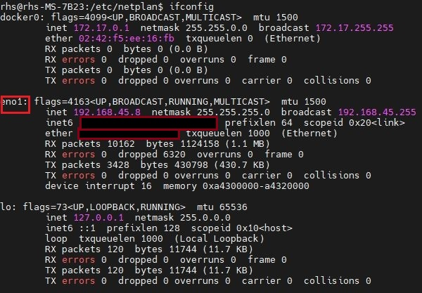

# 문제점
포트포워딩으로 포트를 오픈하여 외부에서도 ip로 접속을 할 수 있게했습니다. 하지만, DHCP가 자동으로 할당되어있기 때문에, 매번 ip가 바뀌는 상황이 생겨, 포트를 열어둔 ip가 호환이 되지 않는 문제가 발생해 외부에서 접속이 불가능할 때가 있습니다. 해당 문제를 해결하기 위해 ip를 고정시키는 것에 대해 이번 포스팅에서 정리해보겠습니다.   

## 고정 IP(CLI)
우선 현재 원겹 접속한 서버에 대한 ip를 보고 싶다면 하기의 cli를 입력하시면 됩니다.   
```bash
ifconfig
ip addr
```   
    
    
상기의 이미지에 빨간색 박스를 친 부분이 인터페이스 이름을 확인할 수 있습니다. 저의 이더넷 인터페이스 이름은 **eno1**입니다. 현재 DHCP로 ip가 설정되어 있어, 컴퓨터를 껐다 켰다 하면 해당 ip대역에서 동적으로 ip가 할당되어 포트포워딩을 하셨다면, 포트포워딩한 ip와 매칭이 안되는 경우가 발생할 수 있습니다. 그럼 이제, DHCP를 사용하지 않으며, 고정 ip로 설정을 해보겠습니다.  
```bash
sudo vi /etc/netplan/01-network-manager-all.yaml
```
상기의 cli를 통해 01-network-manager-all.yaml 파일을 수정해주시면 됩니다. 만약 처음 설치시 DHCP로 설치하셨다면 하기와 같이 나타나실 겁니다.   
```bash
# Let NetworkManager manage all devices on this system
network:
    version: 2
    renderer: NetworkManager
```
여기서 이제 수동으로 IP를 변경해줄 겁니다. 편집 모드로 들어가, 현재 포트포워딩한 ip를 기억하시고 그 ip로 설정을 해주시면 됩니다. 우선 저의 경우에는 ip 게이트웨이가 192.168.45.1로 해당 192.168.43.xx의 대역을 사용하고 있습니다.    
```bash
# Let NetworkManager manage all devices on this system
network:
  ethernets:
    eno1: #Edit this line according to your network interface name.
      dhcp4: no
      addresses:
        - 192.168.45.8/24
      gateway4: 192.168.45.1
      nameservers:
        addresses:
          - 8.8.8.8
          - 8.8.4.4
      routes:
        - to: default
          via: 192.168.45.1
  version: 2
```
저는 상기와 같이 변경하였습니다. 고정 ip로 사용할 ip를 addresses부분에 넣어주고 이더넷 인터페이스명을 ethernets밑의 하단에 eno1을 작성해주었습니다. 또한, dhcp를 사용하지 않겠다는 config값을 no로 설정해주었습니다. 상기와 같이 자신의 컴퓨터에 맞는 인터페이스명과 ip와 게이트웨이 대역을 설정해주시고 :wq를 통해 저장해주시면 됩니다. 이제 파일을 수정했으니 수정한 파일을 netplan에 적용하겠습니다.   
```bash
netplan aaply
```
상기의 CLI를 통해 적용해주면 이제 설정한 고정 ip를 통해 접속이 계속해서 되실 겁니다. 